# BookmarkHub 数据流与同步机制

**版本**: 0.7 | **更新日期**: 2026-05-11

---

## 1. 同步模式概述

BookmarkHub 支持三种同步模式，可灵活配置以满足不同使用场景。

### 1.1 同步模式对比

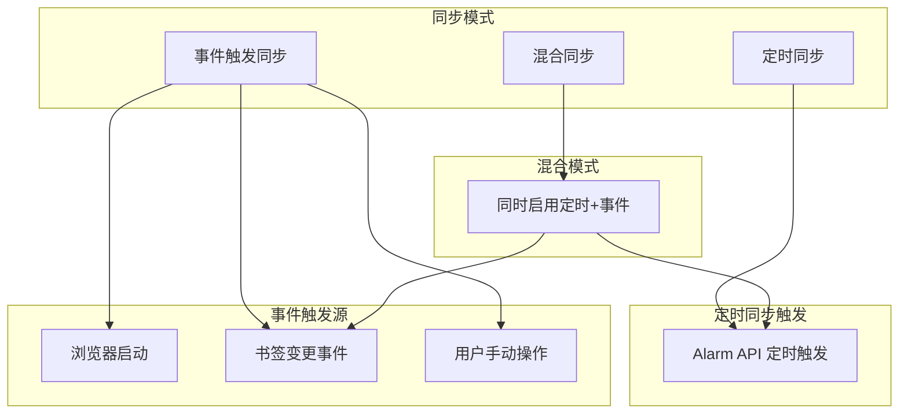

| 模式 | 配置项 | 触发条件 | 适用场景 |
|------|--------|----------|----------|
| **定时同步** | `enableIntervalSync` | Alarm 定时器触发 | 固定周期自动同步 |
| **事件触发** | `enableEventSync` | 书签变更/浏览器启动 | 实时响应变更 |
| **混合模式** | 同时启用 | 定时 + 事件双重触发 | 最大同步保障 |

---

## 2. 同步流程详解

### 2.1 完整同步流程图

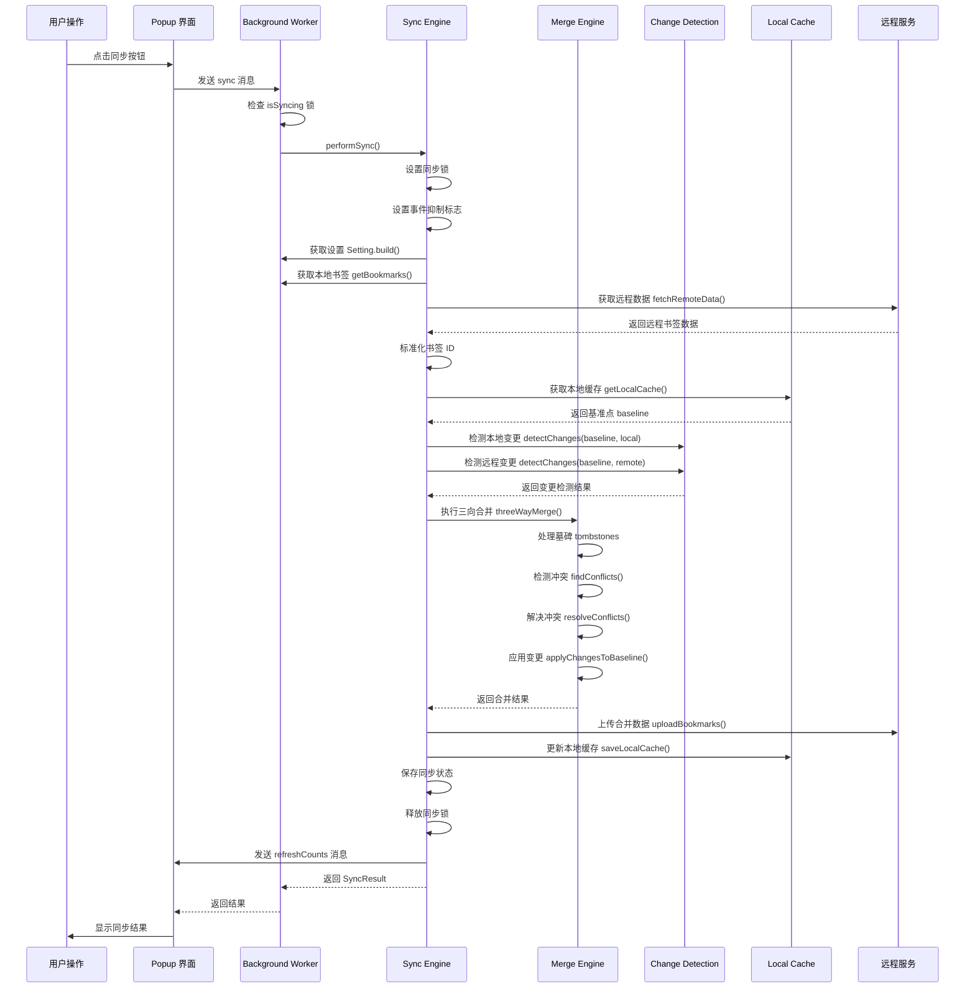

### 2.2 同步流程步骤详解

| 步骤 | 操作 | 说明 |
|------|------|------|
| **1. 锁检查** | `isSyncing` | 防止并发同步，已有同步进行中则跳过 |
| **2. 设置锁** | `isSyncing = true` | 设置同步锁和事件抑制标志 |
| **3. 获取配置** | `Setting.build()` | 从存储读取用户配置 |
| **4. 本地书签** | `getBookmarks()` | 获取浏览器完整书签树 |
| **5. 远程数据** | `fetchRemoteData()` | 从 Gist/WebDAV 获取云端数据 |
| **6. ID 标准化** | `normalizeBookmarkIds()` | 确保本地远程使用相同稳定 ID |
| **7. 基准点获取** | `getLocalCache()` | 获取上次同步状态作为基准 |
| **8. 变更检测** | `detectChanges()` | 检测本地和远程相对基准的变更 |
| **9. 三向合并** | `threeWayMerge()` | 合并两边变更，处理冲突 |
| **10. 上传数据** | `uploadBookmarks()` | 上传合并后的数据到云端 |
| **11. 缓存更新** | `saveLocalCache()` | 更新本地缓存为新基准点 |
| **12. 释放锁** | `isSyncing = false` | 释放同步锁，恢复事件监听 |

---

## 3. 三向合并算法

### 3.1 合并原理

三向合并是分布式同步的核心算法，原理如下：

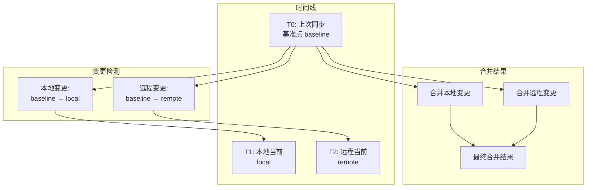

**核心思想**:
- 以 **baseline（上次同步状态）** 作为共同参考点
- 检测 **本地相对 baseline 的变更**
- 检测 **远程相对 baseline 的变更**
- **合并两边变更**，相同变更直接应用，冲突变更按策略处理

### 3.2 变更类型

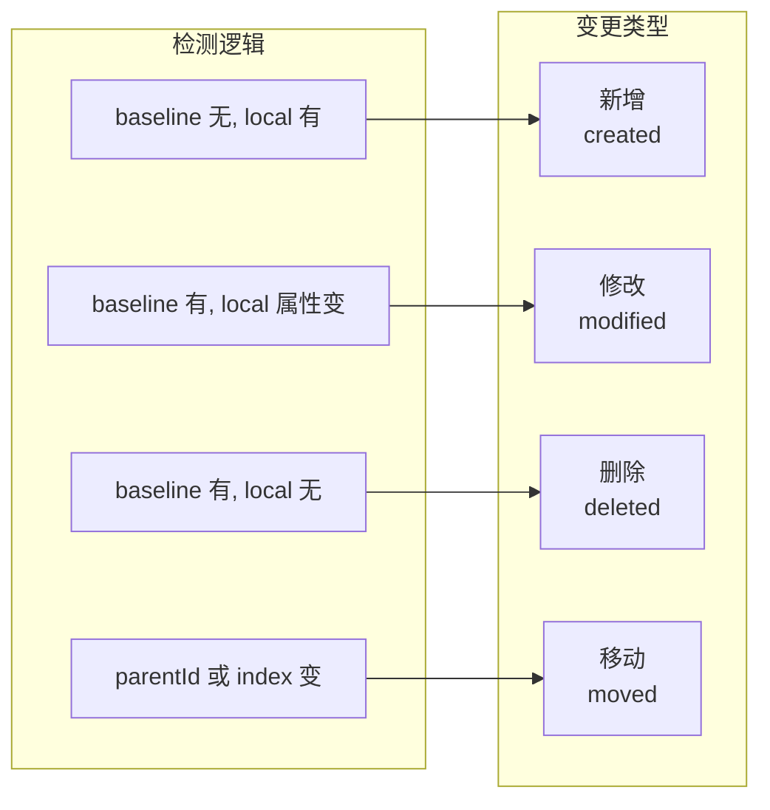

| 变更类型 | 检测条件 | 合并处理 |
|----------|----------|----------|
| **新增** | baseline 无此 ID，当前有 | 合并到结果树 |
| **修改** | ID 相同，title/url 属性变化 | 按时间戳决定版本 |
| **删除** | baseline 有此 ID，当前无 | 应用删除，创建墓碑 |
| **移动** | parentId 或 index 变化 | 按时间戳决定位置 |

### 3.3 冲突处理

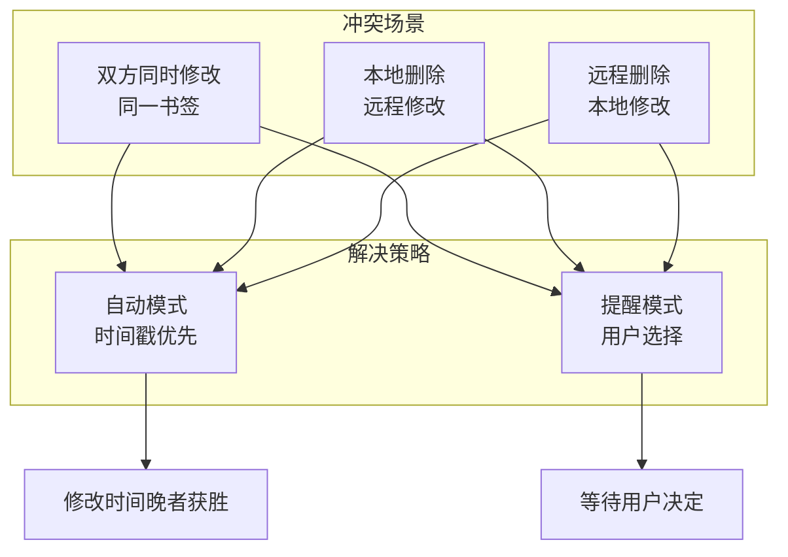

**自动模式冲突解决规则**:
- **修改冲突**: 比较 `dateGroupModified` 或 `dateAdded`，时间晚者获胜
- **删除优先**: 删除操作优先级高于修改（防止数据泄露）
- **新增不冲突**: 双方新增不同 ID 的书签，直接合并

---

## 4. 墓碑机制

### 4.1 墓碑原理

墓碑（Tombstone）是分布式同步中解决删除传播问题的核心机制。

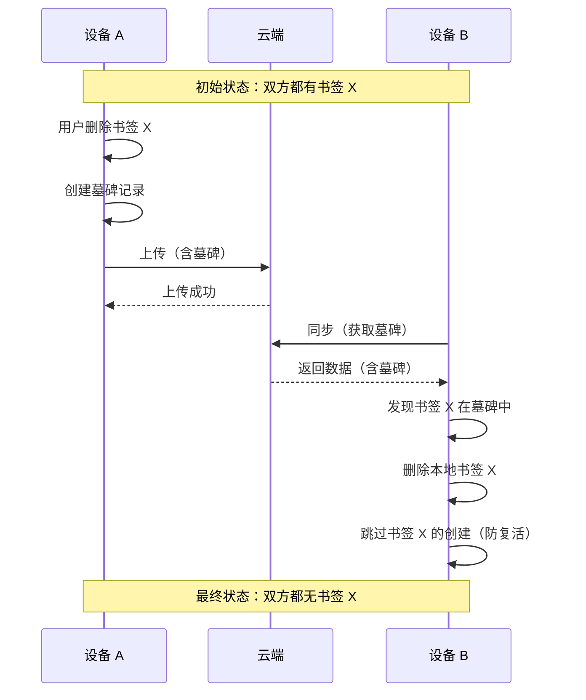

### 4.2 墓碑数据结构

```typescript
interface Tombstone {
    /** 被删除书签的稳定 ID */
    id: string;
    /** 删除时间戳（毫秒） */
    deletedAt: number;
    /** 删除设备标识 */
    deletedBy: string;  // e.g. "Chrome/Windows"
}
```

### 4.3 墓碑生命周期

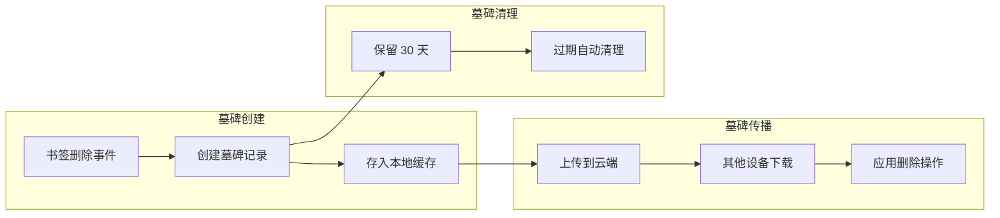

**墓碑管理规则**:
- **保留周期**: 30 天（可在 `cleanExpiredTombstones` 中调整）
- **合并策略**: 相同 ID 的墓碑保留最新时间戳
- **防复活**: 变更检测时过滤掉墓碑中的书签创建

---

## 5. 事件抑制机制

### 5.1 事件抑制原理

同步操作会批量修改书签，如果不抑制事件，会导致递归同步触发。

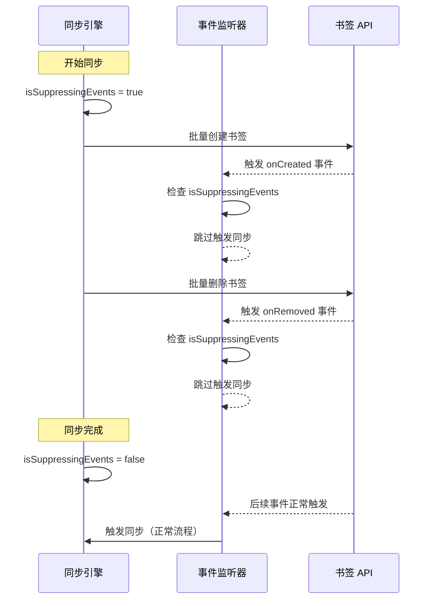

### 5.2 事件监听器结构

```typescript
// sync.ts 事件监听器定义
const syncListeners = {
    onStartup: () => {
        if (!isSuppressingEvents) {
            syncDebouncer.triggerSync();
        }
    },
    onCreated: (id, bookmark) => {
        if (!isSuppressingEvents) {
            syncDebouncer.triggerSync();
            executeCallbacks('onCreated', id, bookmark);
        }
    },
    // ... 其他监听器类似
};
```

---

## 6. MV3 Service Worker 兼容

### 6.1 MV3 挑战

Chrome MV3 中 Service Worker 会休眠，导致：
- 定时器失效
- 内存状态丢失
- 事件监听器注销

### 6.2 解决方案

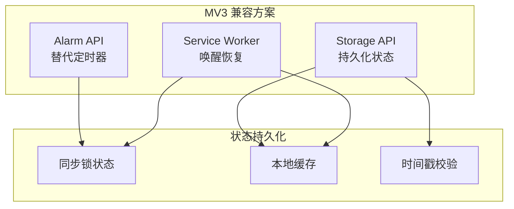

| 问题 | 解决方案 | 实现文件 |
|------|----------|----------|
| 定时同步失效 | Alarm API | `sync.ts:305` |
| 同步锁丢失 | Storage 持久化 | `sync.ts:saveSyncState()` |
| 状态恢复 | 时间戳校验（5分钟过期） | `sync.ts:restoreSyncState()` |

### 6.3 Alarm 配置

```typescript
// MV3 Alarm 监听器
browser.alarms.onAlarm.addListener((alarm) => {
    if (alarm.name === MV3_CONFIG.SYNC_ALARM_NAME) {
        performSync().catch(err => logger.error('alarm sync failed', err));
    }
});

// 创建 Alarm（最小间隔 1 分钟）
browser.alarms.create(MV3_CONFIG.SYNC_ALARM_NAME, {
    periodInMinutes: Math.max(setting.syncInterval / 60, 1)
});
```

---

## 7. 防抖机制

### 7.1 防抖原理

书签变更事件可能短时间内触发多次，防抖确保只执行一次同步。

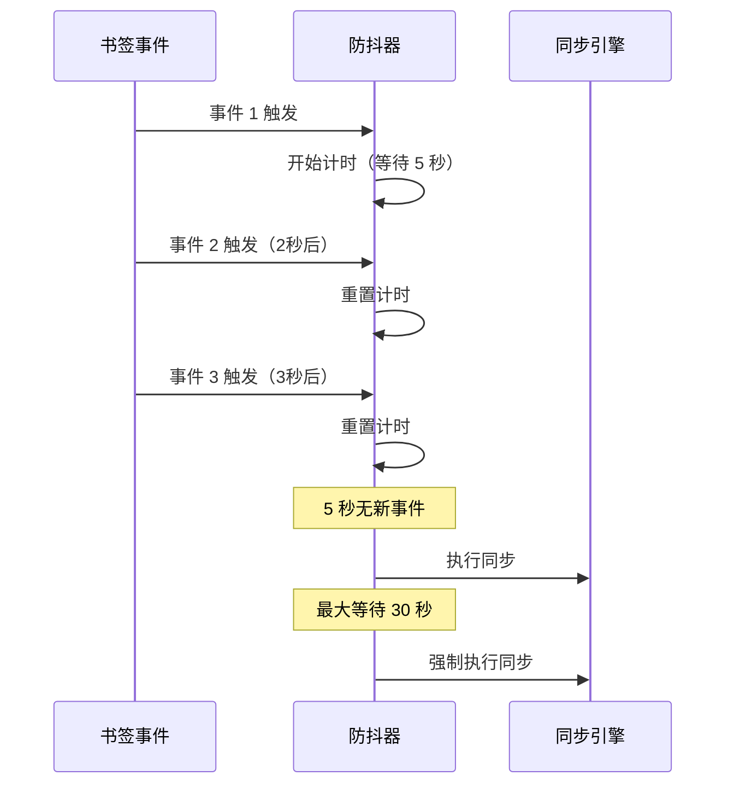

### 7.2 防抖配置

```typescript
// 默认配置
const DEBOUNCE_CONFIG = {
    debounceTime: 5000,    // 5 秒防抖等待
    maxWaitTime: 30000,    // 30 秒最大等待
};
```

---

## 8. 数据流向图

### 8.1 上传流程

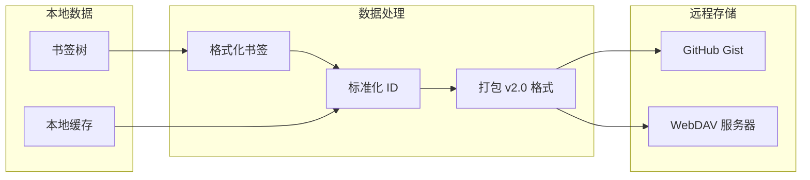

### 8.2 下载流程

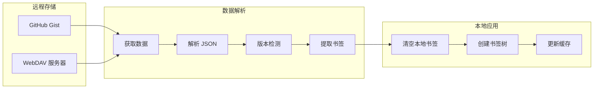

---

## 9. 状态管理

### 9.1 同步状态定义

```typescript
interface SyncState {
    /** 是否正在同步 */
    isSyncing: boolean;
    /** 是否抑制事件 */
    isSuppressingEvents: boolean;
    /** 状态时间戳 */
    timestamp: number;
}
```

### 9.2 状态流转

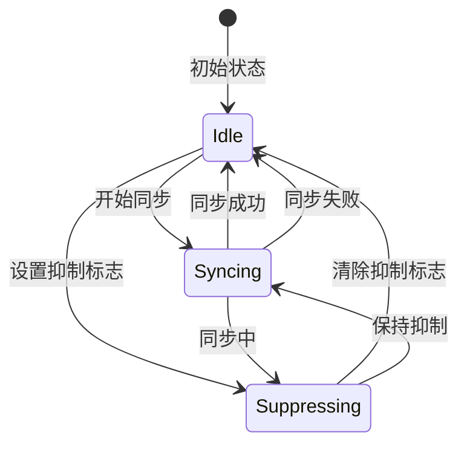

---

## 10. 错误处理流程

### 10.1 错误分类

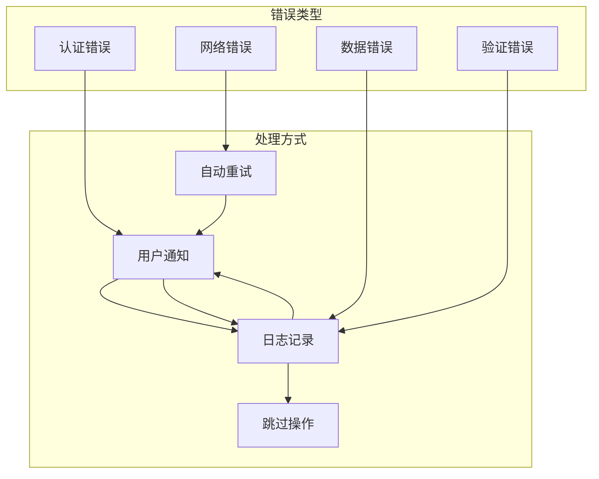

| 错误类型 | 错误码 | 处理策略 |
|----------|--------|----------|
| **Token 缺失** | `AUTH_TOKEN_MISSING` | 提示用户配置 |
| **Gist ID 无效** | `GIST_ID_MISSING` | 提示用户配置 |
| **网络超时** | `NETWORK_ERROR` | 重试 3 次 |
| **文件未找到** | `FILE_NOT_FOUND` | 提示检查 Gist |
| **数据格式错误** | `INVALID_DATA_FORMAT` | 尝试旧格式兼容 |

---

**文档版本**: v1.0 | **作者**: BookmarkHub 开发团队