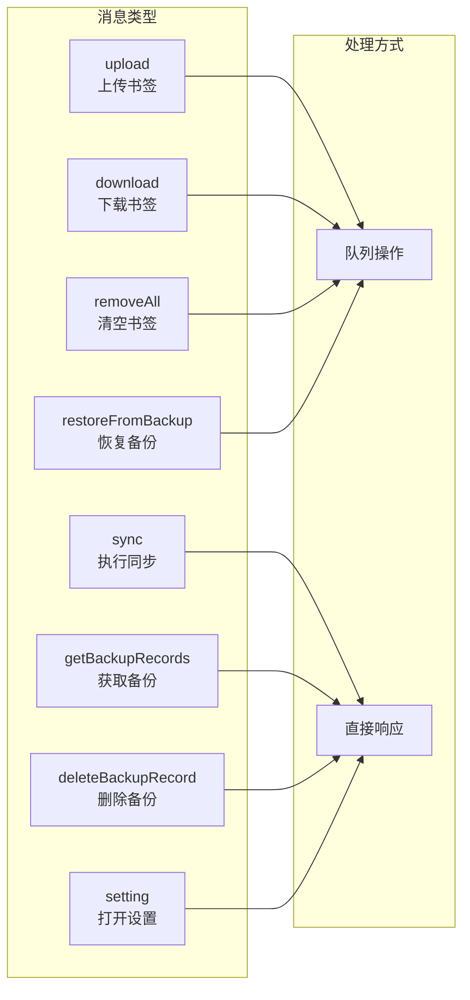

# BookmarkHub 核心模块详解

**版本**: 0.7 | **更新日期**: 2026-05-11

---

## 1. Background 服务 (background.ts)

### 1.1 模块职责

Background 是扩展的 Service Worker，作为扩展的核心后台服务，负责：
- 消息处理与分发
- 同步操作调度
- 书签事件监听
- Alarm 定时器管理
- 墓碑创建管理

### 1.2 消息类型



### 1.3 消息处理代码

```typescript
// 消息监听器核心结构
browser.runtime.onMessage.addListener((msg, sender, sendResponse) => {
    // 验证消息来源（安全）
    if (!isValidSender(sender)) return false;
    
    // 使用操作队列确保顺序执行
    if (msg.name === 'upload') {
        queueOperation(async () => {
            curOperType = OperType.SYNC;
            await uploadBookmarks();
            curOperType = OperType.NONE;
            refreshLocalCount();
            safeSendResponse(sendResponse, true);
        });
        return true;  // 异步响应必需
    }
    // ... 其他消息处理
});
```

### 1.4 操作队列机制

```typescript
// 操作队列 - 防止并发操作交错执行
let operationQueue: Promise<void> = Promise.resolve();

function queueOperation<T>(operation: () => Promise<T>): Promise<T> {
    const resultPromise = new Promise<T>((resolve, reject) => {
        operationQueue = operationQueue.then(async () => {
            try {
                const result = await operation();
                resolve(result);
            } catch (error) {
                reject(error);
            }
        });
    });
    return resultPromise;
}
```

### 1.5 安全验证

```typescript
// P1-9: 验证消息发送者，防止跨扩展攻击
function isValidSender(sender): boolean {
    // 扩展内部消息的 sender.url 以扩展 origin 开头
    if (sender.url) {
        const extensionOrigin = browser.runtime.getURL('/');
        return sender.url.startsWith(extensionOrigin.slice(0, -1));
    }
    // Content scripts 的 sender.id === browser.runtime.id
    if (sender.id === browser.runtime.id) return true;
    return false;  // 拒绝所有其他来源
}
```

---

## 2. 同步引擎 (sync.ts)

### 2.1 核心函数

| 函数 | 职责 |
|------|------|
| `startAutoSync()` | 启动自动同步（Alarm + 事件监听） |
| `stopAutoSync()` | 停止自动同步（清除监听器） |
| `performSync()` | 执行完整同步流程 |
| `uploadBookmarks()` | 上传合并后的数据 |
| `saveSyncState()` | 持久化同步状态 |
| `restoreSyncState()` | 恢复同步状态 |

### 2.2 同步执行流程代码

```typescript
export async function performSync(): Promise<SyncResult> {
    // 1. 恢复持久化状态 (MV3 Service Worker 休眠恢复)
    await restoreSyncState();
    
    // 2. 检查同步锁
    if (isSyncing) {
        return { status: 'skipped', errorMessage: 'Sync already in progress' };
    }
    
    // 3. 设置同步锁
    isSyncing = true;
    isSuppressingEvents = true;
    
    try {
        // 4. 获取配置和书签
        const setting = await Setting.build();
        const localBookmarks = await getBookmarks();
        const remoteData = await fetchRemoteData(setting);
        
        // 5. 标准化 ID
        normalizeBookmarkIds(localBookmarks);
        normalizeBookmarkIds(remoteBookmarks);
        
        // 6. 获取基准点
        const localCache = await getLocalCache();
        const baseline = localCache?.backupRecords?.[0]?.bookmarkData;
        
        // 7. 执行三向合并
        const mergeResult = threeWayMerge({
            baseline, local: localBookmarks, remote: remoteBookmarks,
            localTombstones, remoteTombstones,
            conflictMode: setting.conflictMode
        });
        
        // 8. 上传变更
        if (mergeResult.hasChanges) {
            await uploadBookmarks(mergeResult.merged, mergeResult.tombstones);
        }
        
        // 9. 更新缓存
        await saveLocalCache(mergeResult.merged);
        
        return { status: 'success', ... };
    } finally {
        // 10. 释放同步锁
        isSyncing = false;
        isSuppressingEvents = false;
        await saveSyncState();
    }
}
```

### 2.3 事件监听器注册

```typescript
// 事件监听器定义
const syncListeners = {
    onStartup: () => {
        if (!isSuppressingEvents) syncDebouncer.triggerSync();
    },
    onCreated: (id, bookmark) => {
        if (!isSuppressingEvents) {
            syncDebouncer.triggerSync();
            executeCallbacks('onCreated', id, bookmark);
        }
    },
    // onChanged, onMoved, onRemoved 类似...
};

// 注册监听器
export async function startAutoSync(): Promise<void> {
    if (setting.enableEventSync && !listenersRegistered) {
        browser.runtime.onStartup.addListener(syncListeners.onStartup);
        browser.bookmarks.onCreated.addListener(syncListeners.onCreated);
        browser.bookmarks.onChanged.addListener(syncListeners.onChanged);
        browser.bookmarks.onMoved.addListener(syncListeners.onMoved);
        browser.bookmarks.onRemoved.addListener(syncListeners.onRemoved);
        listenersRegistered = true;
    }
    
    // Alarm 定时同步
    if (setting.enableIntervalSync) {
        browser.alarms.create(MV3_CONFIG.SYNC_ALARM_NAME, {
            periodInMinutes: Math.max(setting.syncInterval / 60, 1)
        });
    }
}
```

---

## 3. 合并引擎 (merge.ts)

### 3.1 三向合并函数

```typescript
export function threeWayMerge(params: ThreeWayMergeParams): ThreeWayMergeResult {
    const { baseline, local, remote, localTombstones, remoteTombstones, conflictMode } = params;
    
    // 1. 无基准点（首次同步）
    if (!baseline || baseline.length === 0) {
        return remote.length > 0
            ? { merged: remote, hasChanges: true, ... }
            : { merged: local, hasChanges: true, ... };
    }
    
    // 2. 检测变更
    const localChanges = detectChanges(baseline, local);
    const remoteChanges = detectChanges(baseline, remote);
    
    // 3. 处理墓碑
    const allTombstones = mergeTombstones(localTombstones, remoteTombstones);
    const tombstoneIds = new Set(allTombstones.map(t => t.id));
    filterChangesByTombstones(localChanges, tombstoneIds);
    filterChangesByTombstones(remoteChanges, tombstoneIds);
    
    // 4. 检测并解决冲突
    const conflicts = findConflicts(localChanges, remoteChanges);
    const resolved = resolveConflicts(conflicts, conflictMode);
    
    // 5. 应用变更到基准点
    const merged = applyChangesToBaseline(baseline, localChanges, remoteChanges, resolved);
    
    // 6. 清理过期墓碑（30天）
    const cleanedTombstones = cleanExpiredTombstones(allTombstones);
    
    // 7. 为删除创建新墓碑
    const newTombstones = createTombstonesForDeletions(localChanges, remoteChanges, resolved);
    const finalTombstones = deduplicateTombstones([...cleanedTombstones, ...newTombstones]);
    
    return { merged: merged, tombstones: finalTombstones, ... };
}
```

### 3.2 变更检测结构

```typescript
interface ChangeDetectionResult {
    /** 所有变更的汇总列表 */
    changes: BookmarkChange[];
    /** 新增的书签 */
    created: BookmarkChange[];
    /** 修改的书签 */
    modified: BookmarkChange[];
    /** 删除的书签 */
    deleted: BookmarkChange[];
    /** 移动的书签 */
    moved: BookmarkChange[];
    /** 是否有变更 */
    hasChanges: boolean;
}

interface BookmarkChange {
    /** 变更类型 */
    type: 'created' | 'modified' | 'deleted' | 'moved';
    /** 变更的书签数据 */
    bookmark: BookmarkInfo;
    /** 变更时间戳 */
    timestamp: number;
}
```

### 3.3 冲突解决策略

```typescript
function resolveConflicts(conflicts: ConflictCandidate[], mode: ConflictMode): ResolvedConflict[] {
    return conflicts.map(c => {
        if (mode === 'auto') {
            // 自动模式：修改时间晚者获胜
            const localTime = c.local.bookmark.dateGroupModified ?? c.local.bookmark.dateAdded ?? 0;
            const remoteTime = c.remote.bookmark.dateGroupModified ?? c.remote.bookmark.dateAdded ?? 0;
            const useLocal = localTime >= remoteTime;
            return {
                ...c,
                winner: useLocal ? 'local' : 'remote',
                isConflict: false  // 已自动解决
            };
        }
        // 提醒模式：标记为冲突，等待用户决定
        return { ...c, winner: null, isConflict: true };
    });
}
```

---

## 4. 变更检测 (changeDetection.ts)

### 4.1 检测函数

```typescript
export function detectChanges(
    baseline: BookmarkInfo[],
    current: BookmarkInfo[]
): ChangeDetectionResult {
    // 构建 ID 映射表
    const baselineMap = buildBookmarkMap(baseline);
    const currentMap = buildBookmarkMap(current);
    
    const created: BookmarkChange[] = [];
    const modified: BookmarkChange[] = [];
    const deleted: BookmarkChange[] = [];
    const moved: BookmarkChange[] = [];
    
    // 检测新增和修改
    for (const [id, bookmark] of currentMap) {
        if (!baselineMap.has(id)) {
            created.push({ type: 'created', bookmark, timestamp: Date.now() });
        } else {
            const base = baselineMap.get(id)!;
            // 检测属性变化
            if (bookmark.title !== base.title || bookmark.url !== base.url) {
                modified.push({ type: 'modified', bookmark, timestamp: Date.now() });
            }
            // 检测移动（parentId 或 index 变化）
            if (bookmark.parentId !== base.parentId || bookmark.index !== base.index) {
                moved.push({ type: 'moved', bookmark, timestamp: Date.now() });
            }
        }
    }
    
    // 检测删除
    for (const [id, bookmark] of baselineMap) {
        if (!currentMap.has(id)) {
            deleted.push({ type: 'deleted', bookmark, timestamp: Date.now() });
        }
    }
    
    return {
        changes: [...created, ...modified, ...deleted, ...moved],
        created, modified, deleted, moved,
        hasChanges: changes.length > 0
    };
}
```

---

## 5. GitHub Gist 服务 (services.ts)

### 5.1 API 接口

```typescript
class BookmarkService {
    /** 获取 Gist 内容 */
    async get(): Promise<string | null> {
        return retryOperation(async () => {
            const setting = await Setting.build();
            
            // 验证 Gist ID 格式（32或40位十六进制）
            if (!validateGistId(setting.gistID)) {
                throw new Error(`Invalid Gist ID format`);
            }
            
            const resp = await http.get(`gists/${setting.gistID}`).json();
            
            // 处理截断文件（使用 raw_url 获取完整内容）
            const gistFile = resp.files[setting.gistFileName];
            if (gistFile.truncated) {
                return await http.get(gistFile.raw_url).text();
            }
            return gistFile.content;
        }, { maxRetries: 3 });
    }
    
    /** 更新 Gist 内容 */
    async update(data: GistUpdateData): Promise<GistResponse> {
        return retryOperation(async () => {
            return await http.patch(`gists/${setting.gistID}`, { json: data }).json();
        }, { maxRetries: 3 });
    }
}
```

### 5.2 Token 安全处理

```typescript
// 错误消息中清理敏感 Token
function sanitizeToken(errorMessage: string, token: string): string {
    if (!token || token.trim() === '') return errorMessage;
    return errorMessage.replace(new RegExp(escapeRegex(token), 'g'), '[REDACTED]');
}
```

---

## 6. WebDAV 客户端 (webdav.ts)

### 6.1 客户端类

```typescript
export class WebDAVClient {
    private baseUrl: string;
    private authHeader: string;
    
    constructor(baseUrl: string, username: string, password: string) {
        // 验证 URL 协议
        if (!baseUrl.startsWith('http://') && !baseUrl.startsWith('https://')) {
            throw new Error('WebDAV URL must start with http:// or https://');
        }
        
        this.baseUrl = baseUrl.replace(/\/$/, '');
        this.authHeader = this.createAuthHeader(username, password);
        // 密码不存储在内存中（安全）
    }
    
    /** 创建 Basic Auth 头（UTF-8 编码） */
    private createAuthHeader(username: string, password: string): string {
        const credentials = `${username}:${password}`;
        const encoder = new TextEncoder();
        const encoded = encoder.encode(credentials);
        const utf8Credentials = Array.from(encoded, b => String.fromCharCode(b)).join('');
        return `Basic ${btoa(utf8Credentials)}`;
    }
    
    /** 读取文件 */
    async read(path: string): Promise<string | null> {
        return retryOperation(async () => {
            const response = await fetch(`${this.baseUrl}${sanitizePath(path)}`, {
                method: 'GET',
                headers: { 'Authorization': this.authHeader }
            });
            if (!response.ok) throw new Error(`WebDAV read failed: ${response.status}`);
            return await response.text();
        }, { maxRetries: 3 });
    }
    
    /** 写入文件 */
    async write(path: string, content: string): Promise<boolean> {
        return retryOperation(async () => {
            const response = await fetch(`${this.baseUrl}${sanitizePath(path)}`, {
                method: 'PUT',
                headers: {
                    'Authorization': this.authHeader,
                    'Content-Type': 'application/json'
                },
                body: content
            });
            return response.ok;
        }, { maxRetries: 3 });
    }
    
    /** 清除凭证（安全最佳实践） */
    clearCredentials(): void {
        this.authHeader = '';
    }
}
```

### 6.2 路径安全处理

```typescript
// 防止路径遍历攻击
function sanitizePath(path: string): string {
    let sanitized = path;
    
    // 循环解码 URL 编码（防止双编码绕过）
    let prev = '';
    while (sanitized !== prev) {
        prev = sanitized;
        try { sanitized = decodeURIComponent(sanitized); } catch { break; }
    }
    
    // 移除危险模式: .. (目录遍历), // (双斜杠), \ (反斜杠), 空字节
    sanitized = sanitized.replace(/\.\.|\/\/|\\|\0|\u0000/g, '');
    
    // 确保以 / 开头
    if (!sanitized.startsWith('/')) sanitized = '/' + sanitized;
    
    // 规范化多个斜杠
    sanitized = sanitized.replace(/\/+/g, '/');
    
    return sanitized;
}
```

---

## 7. 设置管理 (setting.ts)

### 7.1 设置类结构

```typescript
export class SettingBase {
    // GitHub Gist 设置
    githubToken: string = '';
    gistID: string = '';
    gistFileName: string = 'BookmarkHub';
    enableNotify: boolean = true;
    
    // 自动同步设置
    enableAutoSync: boolean = false;
    enableIntervalSync: boolean = false;
    syncInterval: number = 60;        // 分钟
    enableEventSync: boolean = true;
    conflictMode: 'auto' | 'prompt' = 'auto';
    
    // 存储服务设置
    storageType: 'github' | 'webdav' = 'github';
    
    // WebDAV 设置
    webdavUrl: string = '';
    webdavUsername: string = '';
    webdavPassword: string = '';
    webdavPath: string = '/bookmarkhub/bookmarks.json';
    
    // 安全设置
    masterPassword: string = '';
}
```

### 7.2 设置构建（带缓存）

```typescript
export class Setting extends SettingBase {
    private static cachedSetting: Setting | null = null;
    private static cacheTimestamp = 0;
    private static readonly CACHE_TTL = 15 * 1000;  // 15秒缓存
    
    static async build(): Promise<Setting> {
        const now = Date.now();
        
        // 返回缓存（有效期内）
        if (Setting.cachedSetting && now - Setting.cacheTimestamp < Setting.CACHE_TTL) {
            return Setting.cachedSetting;
        }
        
        // 从存储获取所有设置（敏感字段已解密）
        const options = await getAllDecrypted();
        
        const setting = new Setting();
        // 复制所有设置项...
        
        Setting.cachedSetting = setting;
        Setting.cacheTimestamp = now;
        return setting;
    }
    
    static clearCache(): void {
        Setting.cachedSetting = null;
    }
}

// 监听变更，自动清除缓存
optionsStorage.onChanged(() => Setting.clearCache());
```

---

## 8. 错误处理 (errors.ts)

### 8.1 错误类型

```typescript
// 错误类型枚举
export enum ErrorCode {
    AUTH_TOKEN_MISSING = 'AUTH_TOKEN_MISSING',
    GIST_ID_MISSING = 'GIST_ID_MISSING',
    FILE_NAME_MISSING = 'FILE_NAME_MISSING',
    FILE_NOT_FOUND = 'FILE_NOT_FOUND',
    INVALID_DATA_FORMAT = 'INVALID_DATA_FORMAT',
    EMPTY_GIST_FILE = 'EMPTY_GIST_FILE',
    NETWORK_ERROR = 'NETWORK_ERROR',
    WEBDAV_CONNECTION_FAILED = 'WEBDAV_CONNECTION_FAILED',
}

// 自定义错误类
export class BookmarkHubError extends Error {
    code: ErrorCode;
    userMessage: string;
    
    constructor(code: ErrorCode, message: string, userMessage: string) {
        super(message);
        this.code = code;
        this.userMessage = userMessage;
    }
    
    toUserString(): string { return this.userMessage; }
    toLogString(): string { return `[${this.code}] ${this.message}`; }
}
```

### 8.2 错误工厂

```typescript
export const createError = {
    authTokenMissing: () => new BookmarkHubError(
        ErrorCode.AUTH_TOKEN_MISSING,
        'GitHub Token is required',
        '请先设置 GitHub Token'
    ),
    gistIdMissing: () => new BookmarkHubError(
        ErrorCode.GIST_ID_MISSING,
        'Gist ID is required',
        '请先设置 Gist ID'
    ),
    fileNotFound: (fileName: string) => new BookmarkHubError(
        ErrorCode.FILE_NOT_FOUND,
        `File '${fileName}' not found in Gist`,
        `未找到文件：${fileName}`
    ),
    // ... 其他错误工厂
};
```

---

## 9. 本地缓存 (localCache.ts)

### 9.1 缓存结构

```typescript
interface LocalCache {
    /** v2.0 格式的同步数据 */
    syncData?: SyncData;
    /** 备份记录 */
    backupRecords?: BackupRecord[];
    /** 墓碑记录 */
    tombstones?: Tombstone[];
}

// 获取缓存
export async function getLocalCache(): Promise<LocalCache | null> {
    const result = await browser.storage.local.get(STORAGE_KEYS.LOCAL_CACHE);
    return result[STORAGE_KEYS.LOCAL_CACHE] || null;
}

// 保存缓存
export async function saveLocalCache(data: SyncData): Promise<void> {
    await browser.storage.local.set({
        [STORAGE_KEYS.LOCAL_CACHE]: data
    });
}
```

### 9.2 备份管理

```typescript
// 获取备份记录
export async function getBackupRecords(): Promise<BackupRecord[]> {
    const cache = await getLocalCache();
    return cache?.backupRecords || [];
}

// 从备份恢复
export async function restoreFromBackup(timestamp: number): Promise<BookmarkInfo[] | null> {
    const records = await getBackupRecords();
    const record = records.find(r => r.backupTimestamp === timestamp);
    return record?.bookmarkData || null;
}

// 删除备份
export async function deleteBackupRecord(timestamp: number): Promise<boolean> {
    const cache = await getLocalCache();
    if (!cache?.backupRecords) return false;
    cache.backupRecords = cache.backupRecords.filter(r => r.backupTimestamp !== timestamp);
    await saveLocalCache(cache);
    return true;
}
```

---

## 10. 日志系统 (logger.ts)

### 10.1 日志级别

```typescript
export enum LogLevel {
    DEBUG = 0,
    INFO = 1,
    WARN = 2,
    ERROR = 3,
}

// 生产环境默认 INFO 级别
const currentLevel = process.env.NODE_ENV === 'production' ? LogLevel.INFO : LogLevel.DEBUG;
```

### 10.2 日志函数

```typescript
export const logger = {
    debug: (message: string, data?: unknown) => {
        if (currentLevel <= LogLevel.DEBUG) {
            console.debug(`[BookmarkHub] ${message}`, data);
        }
    },
    info: (message: string, data?: unknown) => {
        if (currentLevel <= LogLevel.INFO) {
            console.info(`[BookmarkHub] ${message}`, data);
        }
    },
    warn: (message: string, data?: unknown) => {
        if (currentLevel <= LogLevel.WARN) {
            console.warn(`[BookmarkHub] ${message}`, data);
        }
    },
    error: (message: string, data?: unknown) => {
        if (currentLevel <= LogLevel.ERROR) {
            console.error(`[BookmarkHub] ${message}`, data);
        }
    },
};

// 同步专用日志
export const logSync = {
    start: () => logger.info('同步开始'),
    success: (count: number) => logger.info(`同步成功，共 ${count} 个书签`),
    failed: (error: string) => logger.error(`同步失败: ${error}`),
    skipped: (reason: string) => logger.info(`跳过同步: ${reason}`),
};
```

---

## 11. 重试机制 (retry.ts)

### 11.1 重试函数

```typescript
export async function retryOperation<T>(
    operation: () => Promise<T>,
    options: { maxRetries?: number; delay?: number; logRetries?: boolean } = {}
): Promise<T> {
    const { maxRetries = 3, delay = 1000, logRetries = false } = options;
    
    for (let attempt = 1; attempt <= maxRetries; attempt++) {
        try {
            return await operation();
        } catch (error) {
            if (attempt === maxRetries) throw error;
            
            if (logRetries) {
                logger.warn(`操作失败，第 ${attempt} 次重试`, error);
            }
            
            // 指数退避：delay * 2^(attempt-1)
            const waitTime = delay * Math.pow(2, attempt - 1);
            await new Promise(resolve => setTimeout(resolve, waitTime));
        }
    }
    
    throw new Error('Max retries exceeded');
}
```

---

## 12. 常量定义 (constants.ts)

### 12.1 存储键

```typescript
export const STORAGE_KEYS = {
    LOCAL_COUNT: 'localBookmarkCount',
    REMOTE_COUNT: 'remoteBookmarkCount',
    LAST_SYNC_TIME: 'lastSyncTime',
    LAST_SYNC_STATUS: 'lastSyncStatus',
    LAST_SYNC_ERROR: 'lastSyncError',
    LOCAL_CACHE: 'bookmarkhub_local_cache',
};

export const BACKUP_STORAGE_KEYS = {
    SYNC_STATE_KEY: 'bookmarkhub_sync_state',
};
```

### 12.2 根节点 ID

```typescript
export const ROOT_NODE_IDS = {
    // Chrome 根节点
    ROOT: ['0'],
    TOOLBAR: ['1'],
    UNFILED: ['2'],
    MOBILE: ['3'],
    MENU: ['2'],  // Chrome 无菜单文件夹，使用其他书签
    
    // Firefox 根节点
    // ROOT: ['root________']
    // TOOLBAR: ['toolbar_____']
    // MENU: ['menu________']
    // UNFILED: ['unfiled_____']
    // MOBILE: ['mobile______']
};
```

### 12.3 WebDAV 默认配置

```typescript
export const WEBDAV_DEFAULTS = {
    PATH: '/bookmarkhub/bookmarks.json',
    TIMEOUT: 30000,  // 30秒超时
};

export const BACKUP_DEFAULTS = {
    MAX_BACKUPS: 5,          // 最大备份数量
    DEBOUNCE_TIME: 5000,     // 5秒防抖
    MAX_WAIT_TIME: 30000,    // 30秒最大等待
};

export const MV3_CONFIG = {
    SYNC_ALARM_NAME: 'bookmarkhub-sync-alarm',
};
```

---

**文档版本**: v1.0 | **作者**: BookmarkHub 开发团队