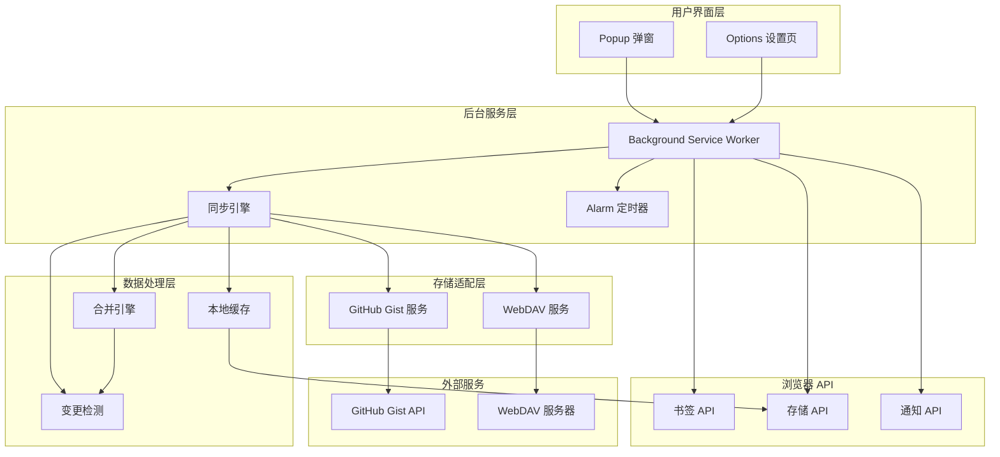
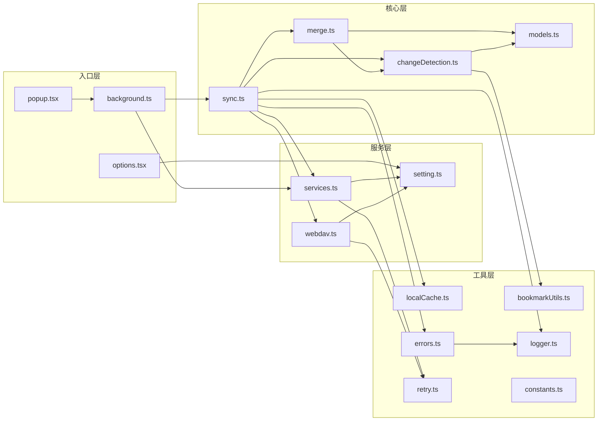
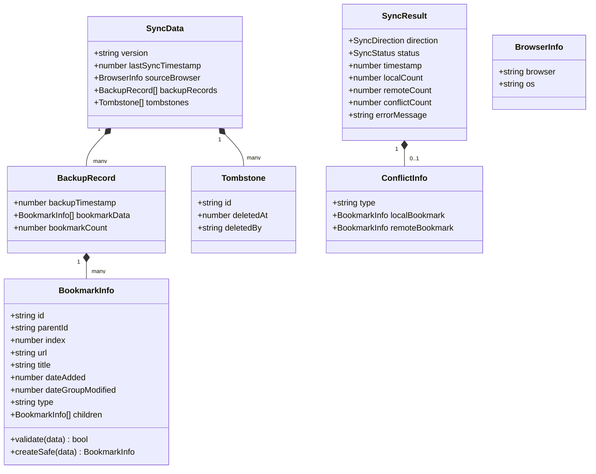
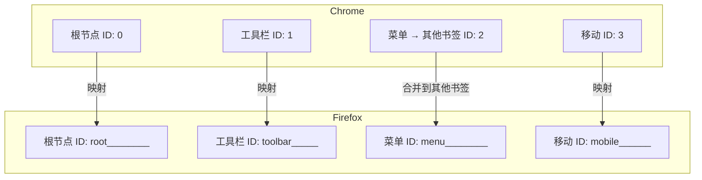

# BookmarkHub 项目架构总览

**版本**: 0.7 | **更新日期**: 2026-05-11 | **分支**: main

---

## 1. 项目简介

BookmarkHub 是一款跨浏览器书签同步扩展程序，支持 Chrome、Firefox、Microsoft Edge 等主流浏览器。通过 GitHub Gist 或 WebDAV 服务存储书签数据，实现多设备间的书签同步。

### 1.1 核心功能

| 功能 | 描述 |
|------|------|
| 书签上传/下载 | 一键上传本地书签到云端，或从云端下载书签 |
| 自动同步 | 支持定时同步、事件触发同步、混合模式同步 |
| 智能合并 | 三向合并算法，自动处理书签冲突 |
| 多存储后端 | 支持 GitHub Gist 和 WebDAV 两种存储方式 |
| 数据导入导出 | 支持 JSON 格式的书签导入导出 |
| 多语言支持 | 支持 10 种语言（中英日韩德法俄意葡阿） |

### 1.2 技术栈

```
┌─────────────────────────────────────────────────────────────┐
│                        技术栈概览                             │
├─────────────────────────────────────────────────────────────┤
│  构建工具    │  WXT 0.19.x (浏览器扩展开发框架)               │
│  前端框架    │  React 18 + TypeScript                        │
│  UI 组件     │  Bootstrap 4 + React-Bootstrap                │
│  HTTP 客户端 │  ky (轻量级 fetch 封装)                        │
│  设置存储    │  webext-options-sync                          │
│  状态管理    │  React Hook Form                              │
│  测试框架    │  Vitest + Testing Library                     │
└─────────────────────────────────────────────────────────────┘
```

---

## 2. 系统架构

### 2.1 整体架构图



### 2.2 目录结构

```
BookmarkHub_MuyuQ/
├── src/                          # 源代码目录
│   ├── entrypoints/              # 扩展入口点
│   │   ├── background.ts         # Service Worker 后台服务
│   │   ├── popup/                # 工具栏弹窗界面
│   │   │   ├── index.html
│   │   │   ├── popup.css
│   │   │   └── popup.tsx
│   │   └── options/              # 设置页面
│   │       ├── index.html
│   │       ├── options.css
│   │       └ options.tsx
│   │
│   ├── utils/                    # 核心工具模块
│   │   ├── sync.ts               # 同步核心逻辑
│   │   ├── sync/                 # 同步子模块
│   │   │   └── dataFetcher.ts    # 数据获取
│   │   ├── merge.ts              # 三向合并引擎
│   │   ├── changeDetection.ts    # 变更检测
│   │   ├── models.ts             # 数据模型定义
│   │   ├── services.ts           # GitHub Gist 服务
│   │   ├── webdav.ts             # WebDAV 客户端
│   │   ├── setting.ts            # 设置管理
│   │   ├── bookmarkUtils.ts      # 书签工具函数
│   │   ├── localCache.ts         # 本地缓存管理
│   │   ├── errors.ts             # 错误处理
│   │   ├── logger.ts             # 日志系统
│   │   ├── retry.ts              # 重试机制
│   │   ├── debounce.ts           # 防抖机制
│   │   ├── constants.ts          # 常量定义
│   │   ├── exporter.ts           # 导出功能
│   │   ├── importer.ts           # 导入功能
│   │   ├── http.ts               # HTTP 客户端
│   │   ├── crypto.ts             # 加密工具
│   │   ├── icons.ts              # 图标管理
│   │   ├── browserInfo.ts        # 浏览器信息
│   │   └── optionsStorage.ts     # 设置存储
│   │
│   ├── public/_locales/          # 国际化文件 (10种语言)
│   │   ├── en/                   # 英语
│   │   ├── zh_CN/                # 简体中文
│   │   ├── ja/                   # 日语
│   │   ├── ko/                   # 韩语
│   │   ├── de/                   # 德语
│   │   ├── fr/                   # 法语
│   │   ├── ru/                   # 俄语
│   │   ├── it/                   # 意大利语
│   │   ├── pt/                   # 葡萄牙语
│   │   └── ar/                   # 阿拉伯语
│   │
│   ├── assets/                   # 静态资源
│   │   └ icon.png                # 扩展图标
│   │
│   └── types/                    # TypeScript 类型定义
│       └ react-hook-form.d.ts
│
├── docs/                         # 文档目录
│   ├── plans/                    # 设计规划文档
│   └ superpowers/                # 详细规格文档
│
├── tests/                        # 测试目录
│   └ setup.ts                    # 测试配置
│
├── wxt.config.ts                 # WXT 配置文件
├── tsconfig.json                 # TypeScript 配置
├── vitest.config.ts              # Vitest 测试配置
└── package.json                  # 项目依赖配置
```

---

## 3. 核心模块说明

### 3.1 模块依赖关系



### 3.2 核心模块职责表

| 模块 | 文件 | 核心职责 |
|------|------|----------|
| **后台服务** | `background.ts` | 消息处理、同步调度、书签事件监听 |
| **同步引擎** | `sync.ts` | 同步流程编排、状态管理、事件抑制 |
| **合并引擎** | `merge.ts` | 三向合并、冲突检测与解决、墓碑处理 |
| **变更检测** | `changeDetection.ts` | 书签增删改移动检测、变更分类 |
| **数据模型** | `models.ts` | BookmarkInfo、SyncData、Tombstone 等类型定义 |
| **Gist 服务** | `services.ts` | GitHub Gist API 射射、重试机制 |
| **WebDAV 服务** | `webdav.ts` | WebDAV 协议客户端、连接测试 |
| **设置管理** | `setting.ts` | 用户配置获取、缓存管理 |

---

## 4. 数据模型

### 4.1 核心数据结构



### 4.2 数据格式版本

| 版本 | 格式 | 说明 |
|------|------|------|
| **v1.0** | `SyncDataInfo` | 旧格式，仅存储书签数组，已弃用 |
| **v2.0** | `SyncData` | 新格式，支持备份记录、墓碑、浏览器信息 |

**v2.0 格式示例**:
```json
{
  "version": "2.0",
  "lastSyncTimestamp": 1699999999999,
  "sourceBrowser": {
    "browser": "Chrome",
    "os": "Windows"
  },
  "backupRecords": [
    {
      "backupTimestamp": 1699999999999,
      "bookmarkData": [...],
      "bookmarkCount": 100
    }
  ],
  "tombstones": [
    {
      "id": "bookmark-id-123",
      "deletedAt": 1699999999999,
      "deletedBy": "Chrome/Windows"
    }
  ]
}
```

---

## 5. 权限配置

### 5.1 必需权限

```typescript
// wxt.config.ts
manifest: {
  permissions: [
    'storage',       // 本地数据存储
    'bookmarks',     // 书签读写
    'notifications', // 操作通知
    'alarms'         // MV3 定时器
  ],
  host_permissions: [
    "https://*.github.com/",           // GitHub API
    "https://*.githubusercontent.com/" // Gist 内容
  ],
  optional_host_permissions: [
    "http://*/*",   // WebDAV HTTP
    "https://*/*"   // WebDAV HTTPS
  ]
}
```

### 5.2 权限用途说明

| 权限 | 用途 |
|------|------|
| `storage` | 存储设置、同步状态、本地缓存、书签计数 |
| `bookmarks` | 获取书签树、创建/删除/移动书签、监听书签事件 |
| `notifications` | 同步成功/失败通知、操作完成提示 |
| `alarms` | MV3 Service Worker 定时同步触发 |

---

## 6. 开发命令

```bash
# 开发模式
npm run dev              # Chrome 开发服务器
npm run dev:firefox      # Firefox 开发服务器

# 生产构建
npm run build            # Chrome 生产构建
npm run build:firefox    # Firefox 生产构建

# 打包发布
npm run zip              # Chrome ZIP 包
npm run zip:firefox      # Firefox ZIP 包

# 类型检查
npm run compile          # TypeScript 编译检查

# 测试
npm run test             # 运行测试
npm run test:watch       # 监听模式测试
npm run test:coverage    # 测试覆盖率报告
```

---

## 7. 跨浏览器兼容性

### 7.1 浏览器差异处理



### 7.2 API 差异

| API | Chrome | Firefox | 处理方式 |
|-----|---------|---------|----------|
| 扩展 API | `chrome.*` | `browser.*` | WXT 自动封装为 `browser.*` |
| Service Worker | MV3 支持 | MV3 支持 | Alarm API 定时触发 |
| 书签根节点 | 数字 ID | 字符串 ID | `detectBrowserType()` 检测 |

---

## 8. 安全考虑

### 8.1 安全措施

| 安全项 | 实现方式 |
|--------|----------|
| Token 过滤 | 错误消息中移除敏感 Token (`sanitizeToken`) |
| 路径验证 | WebDAV 路径清理，防止目录遍历 (`sanitizePath`) |
| URL 协议限制 | 仅允许安全协议 (http/https/ftp/chrome/about) |
| 消息来源验证 | 验证 `sender.url` 防止跨扩展攻击 (`isValidSender`) |
| 凭证清理 | WebDAV 操作后立即清除内存中的认证信息 |

### 8.2 数据安全提醒

⚠️ **注意事项**:
- GitHub Token 和 WebDAV 密码存储在浏览器本地存储（未加密）
- WebDAV 使用 Basic Auth（Base64 编码，非加密）
- Gist 私有性取决于用户设置，公开 Gist 的书签可被搜索
- 生产版本应移除所有 `console.log` 日志

---

## 9. 相关资源

| 资源 | 链接 |
|------|------|
| WXT 文档 | https://wxt.dev/ |
| Chrome 扩展 API | https://developer.chrome.com/docs/extensions/reference/ |
| webext-options-sync | https://github.com/fregante/webext-options-sync |
| GitHub Gist API | https://docs.github.com/en/rest/gists |

---

**文档版本**: v1.0 | **作者**: BookmarkHub 开发团队